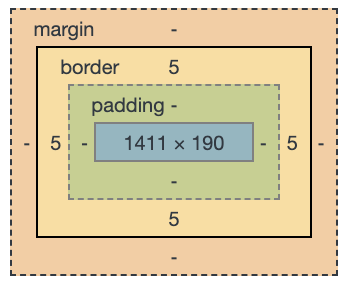
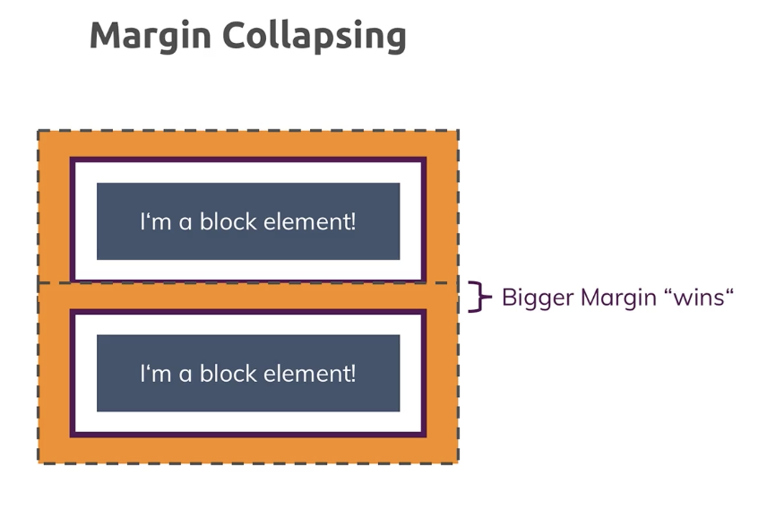
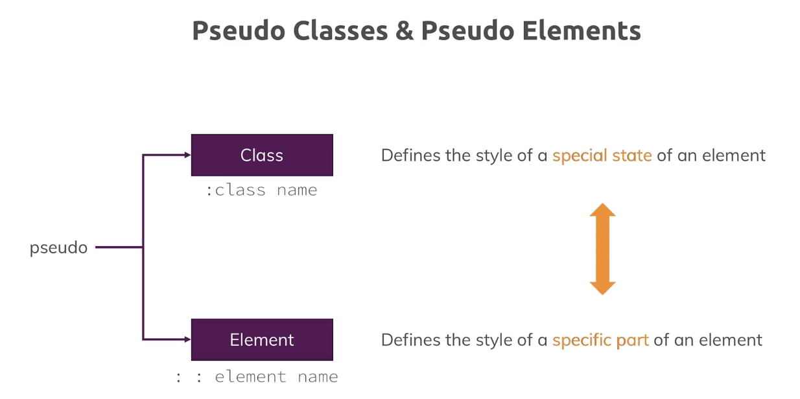
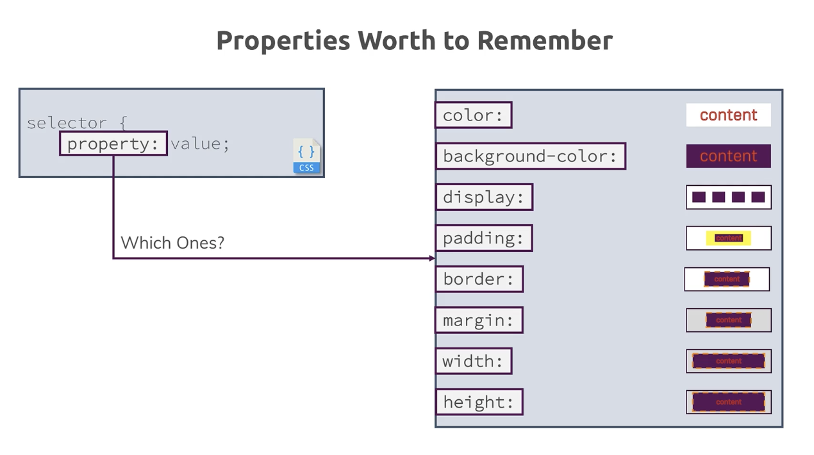
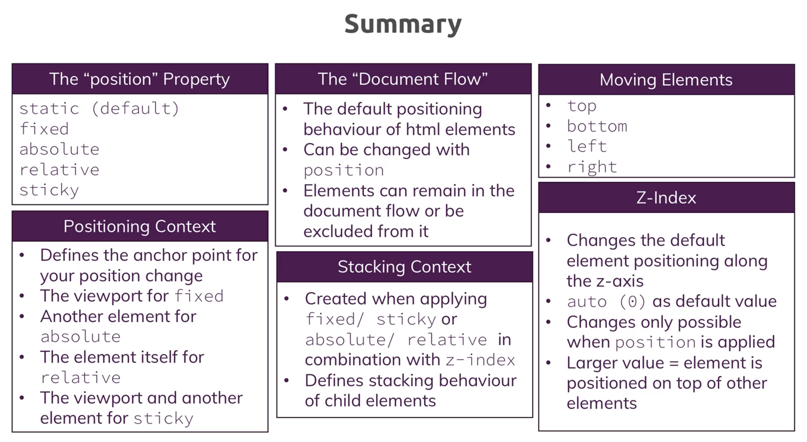

# Getting-Started-CSS

**Reminder**

html skeleton

```html
<html>
    <head>
    </head>
    <body>
        <header></header>
        <main></main>
        <footer></footer>
    </body>
</html>
```

1. Intro

	* BEM notation = Block-Element-Modifier

		* = naming convention for CSS
		    * Block

                ```css
				/* Block component */
				.btn {}
                ```
			* Element

                ```css
				/* Element that depends upon the block */ 
				.btn__price {}
                ```

			* Modifier
                ```css
				/* Modifier that changes the style of the block */
				.btn--orange {} 
				.btn--big {}
                 ```
	* CSS: where ?
		* Inline
        * between `<script>` tags in html			
        * In separate file .css

	* Start van CSS file: "Universal selector"
		* Problem = normally elements 'inherit properties'. 
        
        Example: if we set

		* Body `{box-sizing:border-box}` -> all decending child elemnts would inherit this, BUT browsers somtimes overwrite it. So better is to address ALL elements by `*`
            ```css
			* {
			box-sizing: border-box;
			}
            ```
		
    * **Remark:** default = " box-sizing : content-box " -> this feels not natural

		* When 'content-box' -> height - width defines just content so rest must be added and risks to go off screen
		* When 'border-box' -> width-height = border + padding + content = **WYSIWYG**

    * **The 'box model":**

    
			
    * Display elements: (cfr block-level vs inline elements)
        * " display : ….. "
            * display: block :
                * Takes all the available space
                * You can set  margin-top margin-bottom			* Eg: `<div> <nav>  <h1> <p>...`
            * display: inline:
                * Takes only the space they need
                    * margin-top /bottom han NO effect
                    * Padding has different effect
                    * Eg: `<a> <span>`
                * display: inline-block 
                        
                * display: none
                    * Removes element from document
                    * Other elements will move and take its space
                    * Remark:
                        * Visibility:hidden
                            * Will remain and holds its place but not visible
    * Margin colapsing

    

    * Specificity:
        * Pseudo Class - Pseudo Element
            Zie MDN

    

    * Vb:
        * Pseudo class:
            * li:hover -> om van kleur te wijzigen bvb in navbar
            *  :focus :active etc -> zie MDN
            * Pseudo element:
                * p::first-letter -> om eerste letter van p te stylen zoals in krant
            * Combining multiple rules (different than colmbinators!)
                ```css
                .main-nav__item a:hover,
                .main-nav__item a:hover{
                color:#aaaaaa;
                }
                ```
            *  Difference: :hover   :focus   :active
                * Remember: a computer has many input devices!
                
                *  Hover:
                        ® Time when mouse is over elemnt
                        ® ! Do not use hover on mobile devices-> get stuck!
                        
                * Focus:
                    * When element has 'focus' -evident :-)
                        * = at the moment button is clicked
                        * Eg: input text field can have focus while hovering with mouse over other elements
                    * ! Geeft "blauwe" 'outline -> kunnen dit afzetten met onderstaande
                        * Outline = maakt geen deel uit van box-model!
                            (cfr afmetingen)
                        ```css
                            .button:focus{
                            outline:none;
                            }
                        ```
                            
                * Active:
                    * Time when pressing button down.
2. Hierarchy:

	* `<html>`
	    * `<body>`
		    * `<main>`
				* `<element>`

    If we set "height:100%" -> 100% refers to 'parent'. So if nothing is set at parrent it will be 100% of nothing. 

	* When refering to the total page -> we need to go and chain upto <html>. If set height:100% at this level, it will refer to the full page and a child set at 50% wil take 50% height of screen.

**Summary:**



* !important -> do NOT use it -> bad coding (all over the place!!)
	Goal = it overwrites all other 'specificity' -> will lead to more !important :-(
        ```css
		h1 { 
		color: red !important;
		}
        ````

3. Positioning
	
	* 'position':
		* Static = default -> according to document flow.
		* 'fixed':
			* Element comes out of document flow -> does not exist for other elements
			* Context reference = viewport
			* A block element becomes 'inline-blox'
			* Now we can use 
				* 'top:…' 
				* 'bottom:…'
				* 'left:…'
				* 'right:…' 
					* To position element on screen
					* Mostly used to fix a top navigation bar
					* Remark: use box-sizing:border-box in case of problem with borders!
			* Z-index:
				* 'auto' (default and = 0)
				* Value greater than will position it on top, smaller will be below
					* Eg: 'z-index: -1' ->will position it under cfr background image
		* 'absolute'
			* Element komt los uit document flow
			* If no parent has a position property -> html box is the context
			* If a parent element has: 'position:relative'
				□ -> this parent is the reference context
		* 'relative'
			* Element blijft IN documentflow
			* Element verschuift tov zijn originele plaats
		    *  **Remark:** In case you want to hide your element once is start going out of the parent:
                * Overflow:hidden (on the parent)
        * 'sticky':
            * element moves normally in the viewport until it reaches a treshold, and than becomes fixed.
            * posistion property changes dynamically between 'relative' and 'fixed. 
            ```css
            .character {
                position: sticky;
                top:0px;
            }
            ```
            see example: [MDN](https://developer.mozilla.org/en-US/docs/Web/CSS/position#Sticky_positioning)
    * stacking context:
        * stacking of elements is defined by the Z-index
        * BUT:
            * **important:** the stacking context is always inside the parent
            * imagine:
                * element B1 with parent A1
                * element B2 with parent A2
                * Z-index A2 > A2
                * Z index B1 > B2
                * Then B2, with a lower Z-index, will be on top of B1. Because the parent A2 wins it from A1! So the Z-index is always evaluated within the parent.
    
    **Summary:**

    | Position | default | in document flow ? |
    |----------|  :---:  |   :------:         |
    | static   | yes     | yes                |
    | fixed    | no      | no                 |
    | absolute | no      | no               |
    | relative | no      | yes                |
    | sticky   | no      | yes/no             |


    

